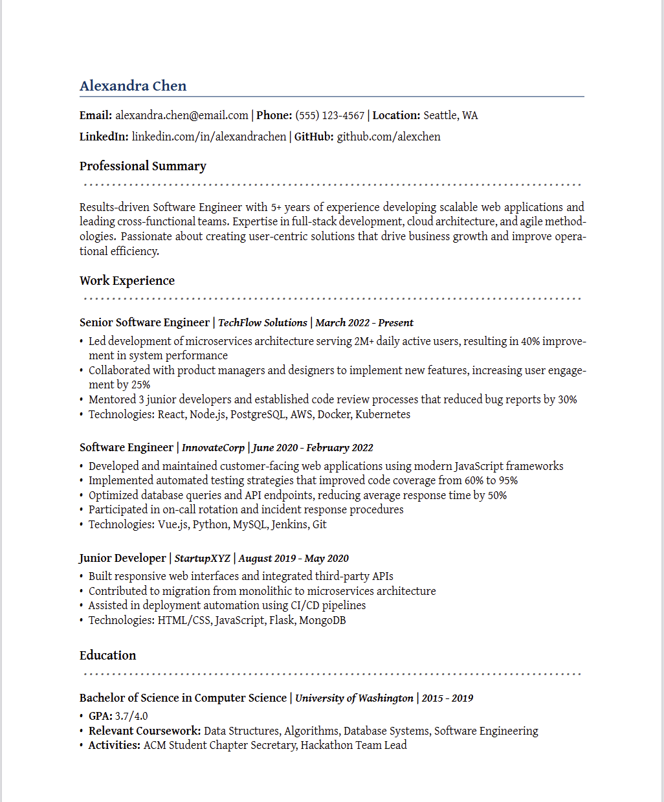

# SmartResume

A smart and elegant tool to convert Markdown-based resumes to beautifully formatted PDFs using Pandoc and LaTeX templates.

## Features

- Convert Markdown resume to professional PDF format
- Custom LaTeX template with modern styling
- Support for various fonts and formatting options
- Clean, minimalist design optimized for readability

## Dependencies

### System Requirements

This tool requires the following system-level dependencies:

1. **Pandoc** - Document converter
2. **TeX Live Full** - Complete LaTeX distribution
3. **Core Fonts** (recommended for Linux users) - Windows core fonts for better compatibility

### Python Dependencies

- Python >= 3.10
- pypandoc >= 1.15

## Installation

### 1. Install System Dependencies

#### Ubuntu/Debian:
```bash
# Install pandoc and texlive-full
sudo apt update
sudo apt install pandoc texlive-full

# Install Windows core fonts (recommended)
sudo apt install ttf-mscorefonts-installer
```

#### macOS:
```bash
# Using Homebrew
brew install pandoc
brew install --cask mactex

# Or install BasicTeX for a smaller footprint
brew install --cask basictex
```

#### Windows:
```bash
# Using Chocolatey
choco install pandoc
choco install miktex

# Or download installers from:
# Pandoc: https://pandoc.org/installing.html
# MiKTeX: https://miktex.org/download
```

### 2. Install Python Package

Clone the repository and install dependencies:

```bash
git clone <repository-url>
cd smartresume
pip install -e .
```

Or using uv (recommended):

```bash
uv sync
```

## Usage

### Basic Usage

1. **Prepare your resume**: Edit the Markdown file at `markdown/resume.md` with your resume content.

2. **Run the converter**:

   if you instralled the dependencies with pip:
   
   ```bash
   python main.py
   
   ```
   or if you installed the dependencies with uv:
   
   ```bash
   uv run main.py
   ```

3. **Output**: The generated PDF will be saved to `output/resume.pdf`.

   Here is an example PDF resume with the default template:

   

### Customizing Your Resume

#### Markdown Format

Your resume should be written in Markdown format. The example `markdown/resume.md` shows the expected structure:

```markdown
---
mainfont: Times New Roman
---
# Your Name

Contact information

## SECTION TITLE
Content goes here...
```

#### Font Customization

You can specify fonts in the YAML front matter:

```yaml
---
mainfont: Times New Roman
# or use other fonts like:
# mainfont: Gentium Plus
# mainfont: Arial
---
```

#### Template Customization

The LaTeX template (`default_template.tex`) can be modified to change:
- Colors and styling
- Layout and margins
- Font configurations
- Section formatting


## Troubleshooting

### Common Issues

1. **Font not found errors**: Install the specified fonts or change to system-available fonts in the YAML front matter.

2. **Pandoc conversion errors**: Ensure all system dependencies are properly installed.

3. **XeLaTeX errors**: The template uses XeLaTeX for better font support. Make sure your TeX distribution is complete.

### Font Installation on Linux

For best results on Linux systems, install Windows core fonts:

```bash
sudo apt install ttf-mscorefonts-installer
sudo fc-cache -f -v
```

## Contributing

PRs are welcome!

## Future Plan:

* Add support for exporting other formats such as word. 
* Multi-agent AI system for automatic modification of the resume based on various context such as job description or user provided materials. 
* A friendly Notion-like UI system.   